#### UNIVERSIDAD DE SAN CARLOS DE GUATEMALA
#### FACULTAD DE INGENIERÍA
#### ESCUELA DE CIENCIAS Y SISTEMAS
#### LENGUAJES FORMALES Y DE PROGRAMACION B+
#### ING. DAVID MORALES
#### AUX. FRANCISCO MAGDIEL ASICONA MATEO
#
#
#

### 
PROYECTO NO. 2 : MANUAL TÉCNICO
 
#
#
#
#### 
JAIRO ADELSO GOMEZ HERNANDEZ
 
#### 
CARNE : 201902672
 
#### 
2993206770101
 
#### 
SECCION B+
 
#### 
29 DE OCTUBRE DE 2023
 

-----
#### *Requerimientos*
##### - Sistema Operativo Windows
•	Procesador: de 1 gigahercio (GHz), o procesador o SoC más rápido
•	RAM: 1 gigabyte (GB) para 32 bits o 2 GB para 64 bit
•	Espacio en disco duro:16 GB para el sistema operativo de 32 bits o
•	20 GB para el sistema operativo de 64 bits
•	Tarjeta gráfica: DirectX 9 o posterior con controlador WDDM 1.0
•	Pantalla: 800 x 600

##### - Python 3.11.4
•	Sistema Operativo: Windows 10 (8u51 y superiores)
•	RAM: 128 MB
•	Espacio en disco: 1 GB 
•	Procesador: Mínimo Pentium 2 a 266 MHz

##### - Visual Studio Code
•	Sistema Operativo: Windows 10 (8u51 y superiores)
•	RAM: 1 GB RAM
•	Espacio en disco: 200 MB 
•	Procesador: Mínimo Procesador 1.6 GHz o superior

------

#### main .py
##### Clase app:

######  __init __

En el metodo __init __ aca se creara la ventana, los botones, el area de texto y sus funcionalidades para que la interfaz grafica. Definiendo asi como el tamaño de la ventana y la funcionalidad de cada boton.

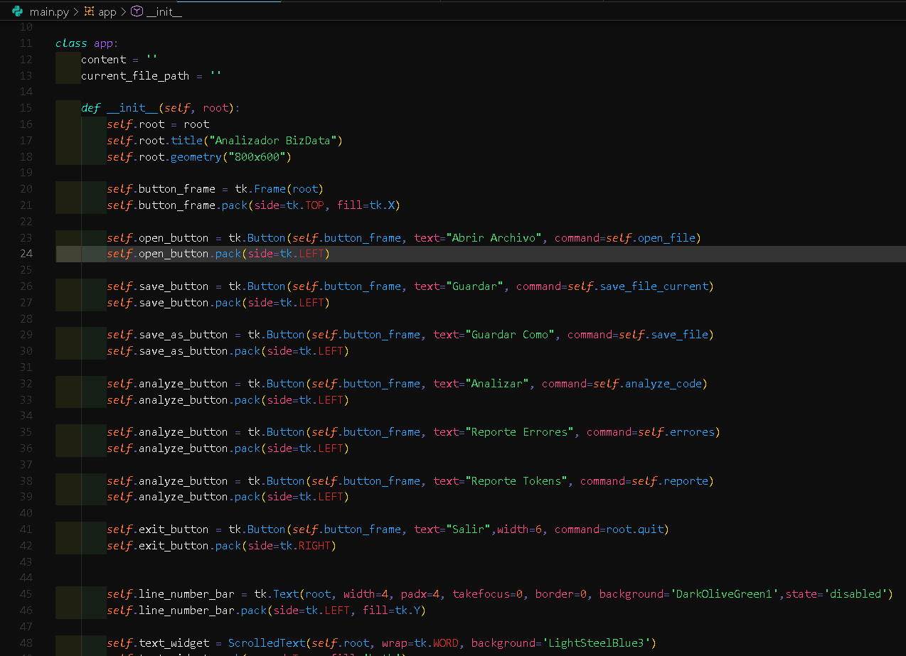

##### open_file

En el metodo _open_file_, se crea la funcionalidad en el cual abriremos una ventana emergente.
~~~
file_path = filedialog.askopenfilename(filetypes=[("Archivos con Formato JSON", "*.json")])
        if file_path:
            self.current_file_path = file_path
            with open(file_path, 'r') as file:
                self.content = file.read()
                self.text_widget.delete(1.0, tk.END)
                self.text_widget.insert(tk.END, self.content)
            self.update_line_numbers()
~~~
En el cual pediremos que seleccione un archivo con formato json, y lo guardaremos en _file_path_ y recibiremos el contenido para asi ser guardado y mostrado en el area de texto creada.

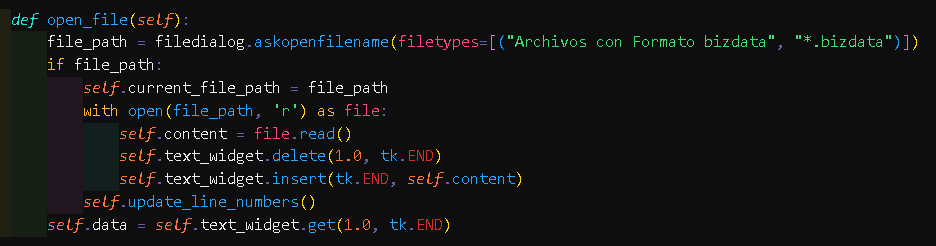

##### save_file_current

En el metodo _save_file_current_ creamos la funcionalidad de guardar sobre el mismo archivo que abrimos en el metodo _open_file_

~~~
    if self.current_file_path:
        self.content = self.text_widget.get(1.0, tk.END)
        with open(self.current_file_path, 'w') as file:
            file.write(self.content)
        messagebox.showinfo("Guardado", "Archivo guardado exitosamente.")
    else:
        messagebox.showerror("Error", "No se ha abierto ningún archivo para guardar.")
~~~

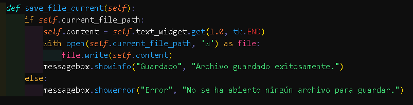

##### save_file

~~~
file_path = filedialog.asksaveasfilename(defaultextension=".json", filetypes=[("Archivos de con Formato JSON", "*.json")])
        if file_path:
            self.content = self.text_widget.get(1.0, tk.END)
            with open(file_path, 'w') as file:
                file.write(self.content)
            messagebox.showinfo("Guardado", "Archivo guardado exitosamente.")
~~~

En este metodo _save_file_ creamos la funcionalidad guardar como, en la cual guardaremos el contenido de la area de texto, pidiendo asi la direccion de donde queremos guardar el archivo, asi como en un archivo ya creado previamente.

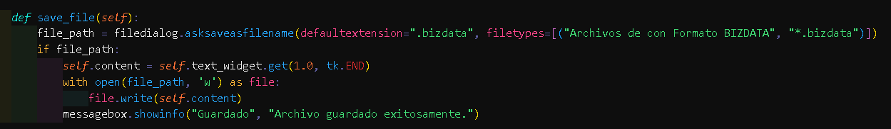

##### analizar

En este metodo analizar, se importa la funcionalidad de analizar, el cual lo importamos desde el archivo "_AnalizadorLexico .py_" & "_AnalizadorSintactico .py_" & para recibir las instrucciones y procesarlas con su sus Clases.

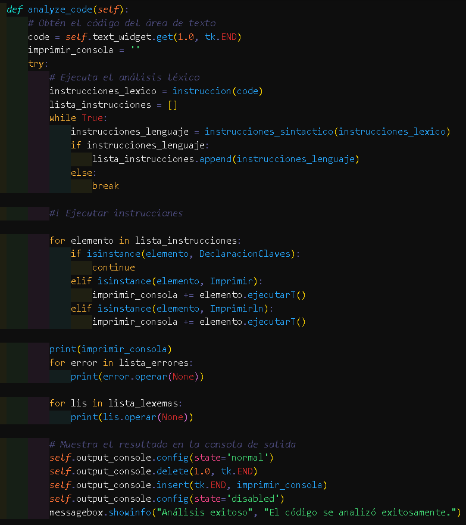

##### errores

En este metodo errores, se importa la funcionalidad para el boton errores, el cual usamos nuestro metodo "generar_reporte_errores(lista_errores)" en el cual establecemos la estructura HTML para que se pueda mostrar los errores.

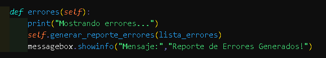

##### generar_reporte_errores(lista_errores)

En este metodo, se establece la estructura HTML para hacer la tabla en la cual se mostrara los errores, asi como un "for" con el cual recorremos nuestra lista "lista_errores" para obtener los errores encontrados en el analisis.

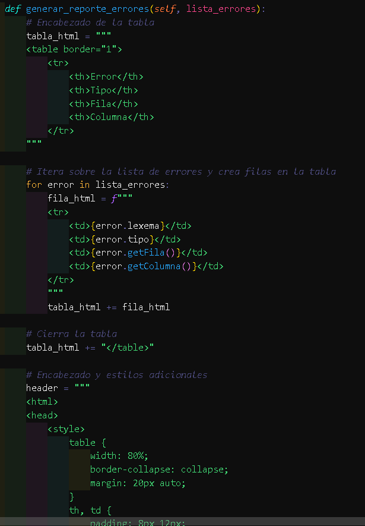
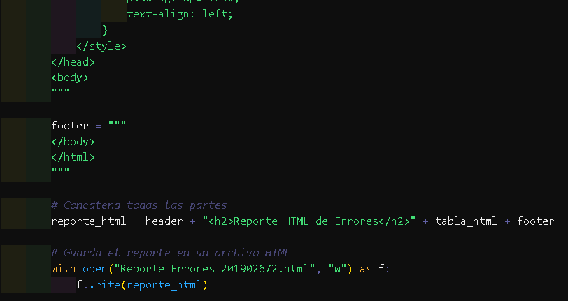

##### reporte

En este metodo reporte, se importa la funcionalidad para el boton reporte, el cual usamos nuestro metodo "generar_reporte_errores(lista_errores)" en el cual establecemos la estructura HTML para que se pueda mostrar los errores.

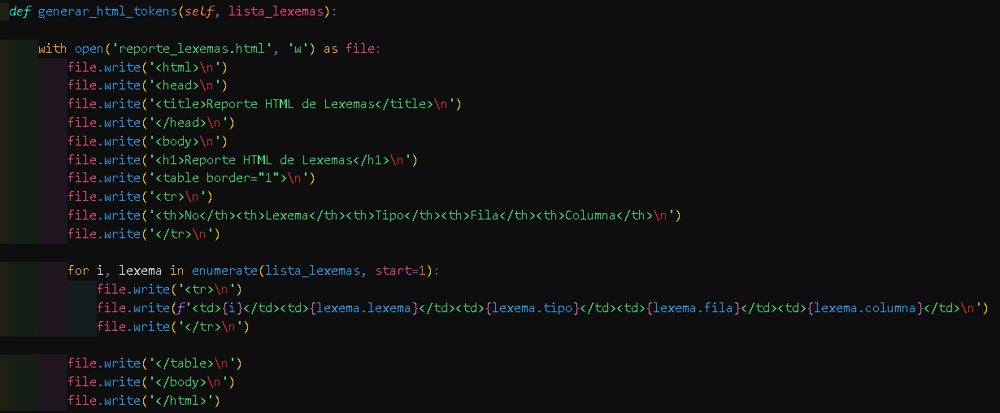

#### AnalizadorLexico .py

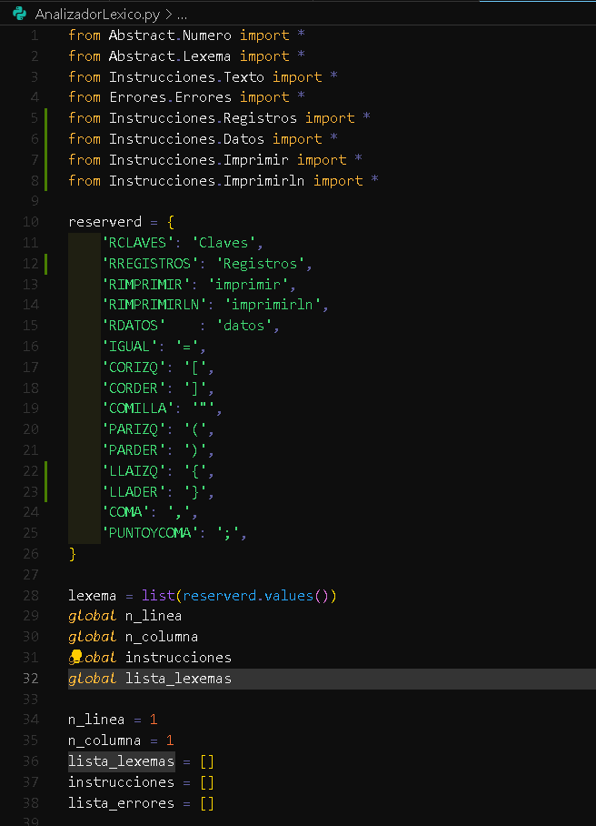

En esta clase se importan nuestras clases abstractas, asi como las instrucciones que recibiremos, se declaran las palabras reservadas, se definen las listas en las cuales se guardara el contenido.

##### instrucciones(cadena)

En este metodo recorreremos el _texto_ lo cual sera asignandole un indice, eh iremos recorriendo caracter para ir reconociendo y asignandolo a su lista correspondiente con sus parametros creados previamente en las clases como _lexema_ , _errores_
tambien para encontrar numeros y mandarlos al metodo _armar_numero_ y _armar_lexema_ 

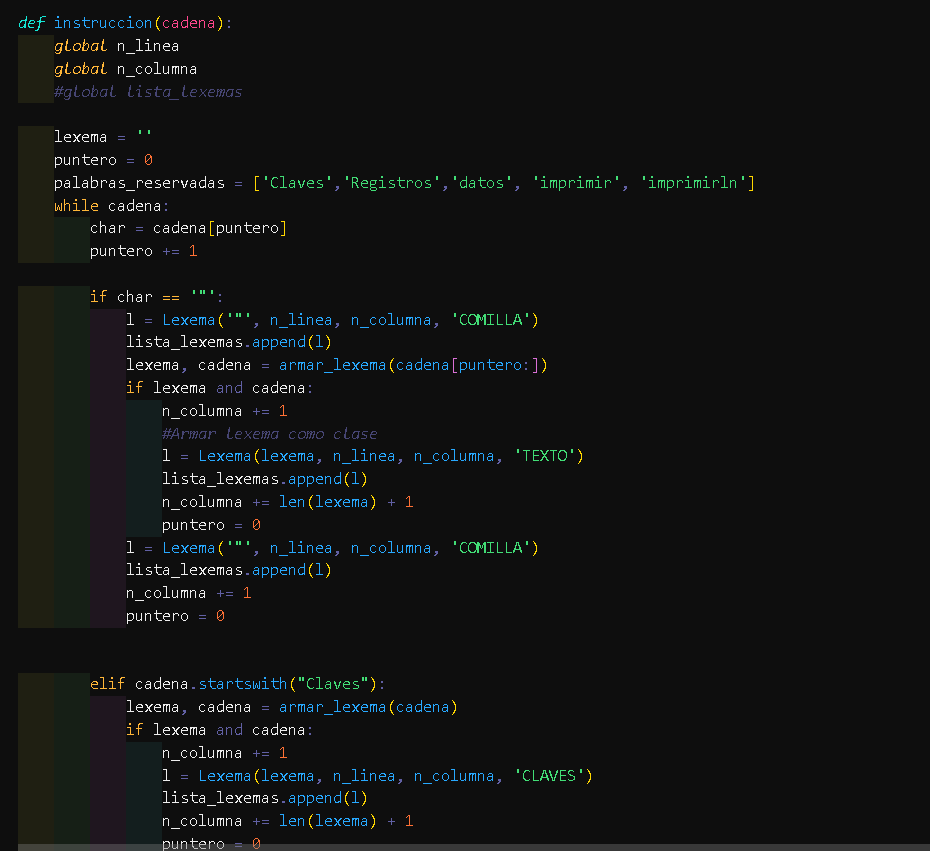

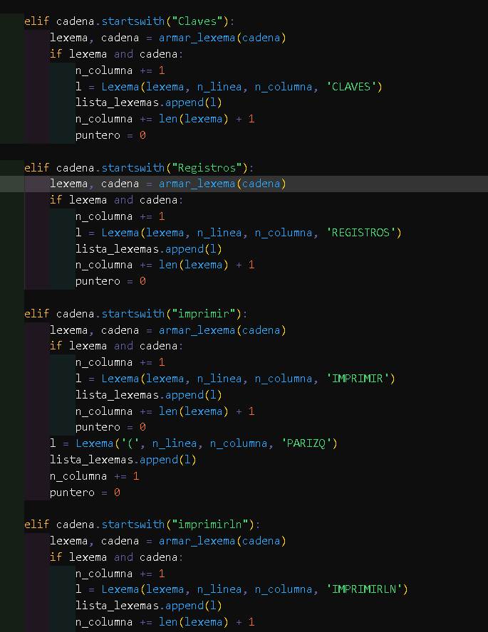
Esto para armar nuestras listas, y asi hacer las operaciones y reportes.

##### armar_lexema

En este metodo recorremos el texto, para armar nuestro lexema, separandolo en cada caracter analizado.
~~~
for caracter in texto:
            indice += caracter
            if caracter == '\"':
                return tk_lexema, texto[len(indice):] 
            else:
                tk_lexema += caracter
~~~

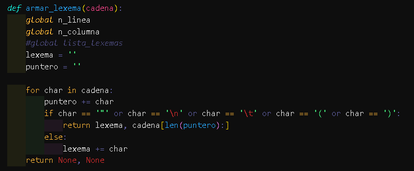

##### armar_numero

En este metodo recorremos el texto, para armar nuestros numeros, separandolo en cada caracter analizados.

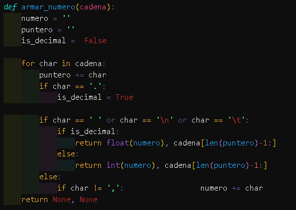

#### AnalizadorSintactico .py

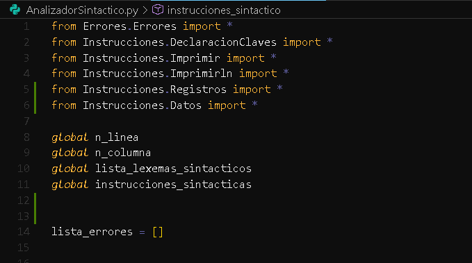

#### instrucciones_sintactico(lista_lexemas)

En este metodo se recorrera la lista_lexemas uniendo las frases y buscando en nuestro metodos las palabras reservadas, y asi haciendo la accion que se nos pida. Al detectar la frase *"Claves"* iremos buscando paracter por caracter para saber que la estructura es correcta, en caso sea incorrecta, guardaremos nuestro errores en *lista_errores* para luego hacer un reporte

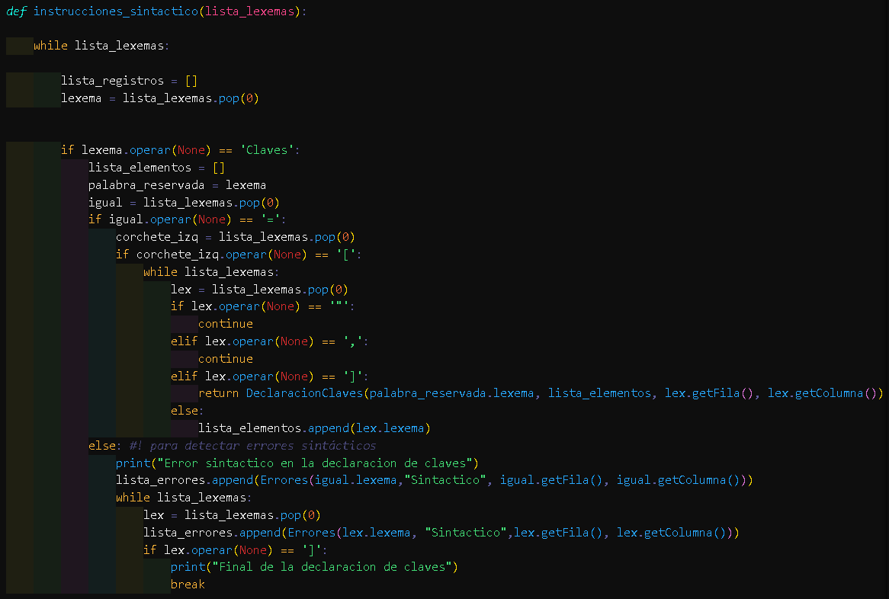
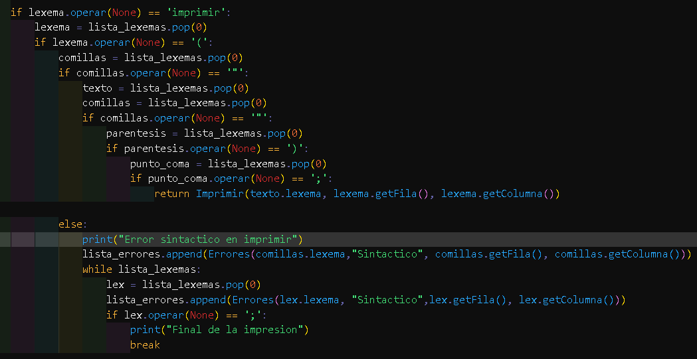
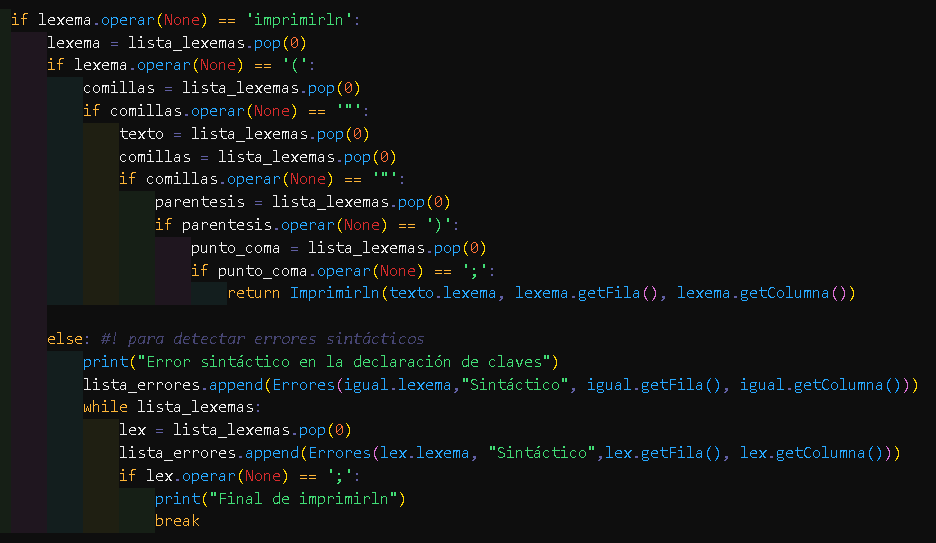

En cada validacion de buscar la palabra reservada, debemos agregar un *else* para asi verificar los errores que se puedan encontrar durante el analisis y asi agregarlos a nuestra *lista_errores* mostrando en consola los errores. 

#### Abstract
###### *Clase Abstract. py*

Se crea un metodo abstracto para el uso de nuestras funciones.

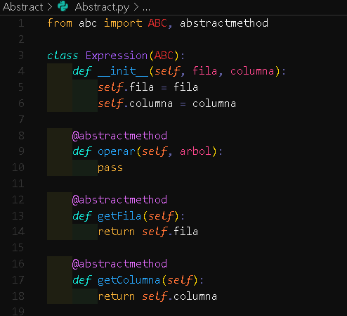

###### *Clase Lexema. py*

Se crea un metodo en el cual retornamos el lexema, el tipo, la fila y la columna

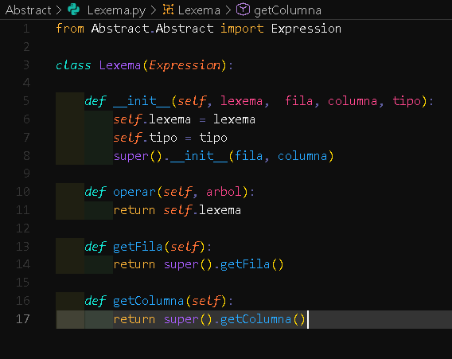

###### *Clase Numero. py*

Se crea un metodo en el cual retornamos el valor, esto para faciltar las operaciones en las instruccines.

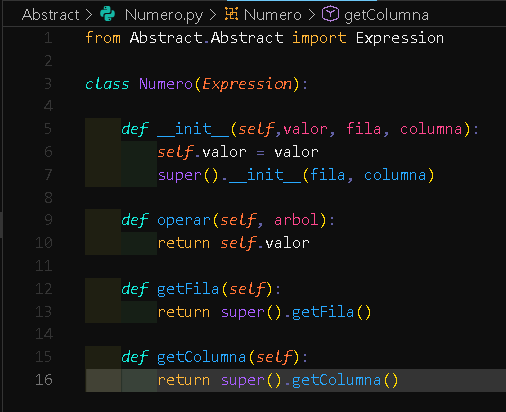

#### Errores .py
##### Clase errores

Se crea un el constructor con los atributos tales como lexema, tipo, fila, columna. Esto para retornar los errores encontrados con una estructura agradable al usuario.

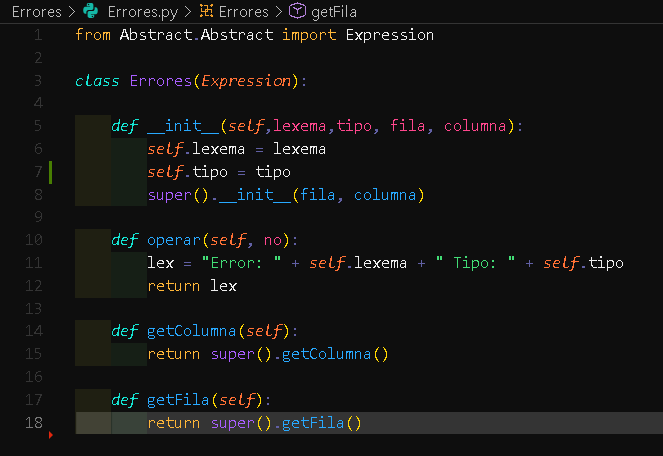

#### Instrucciones
##### Texto. py

Se crea la un constructor con los atributos, texto, tipo, fila y columna. Esto para retornar los lexema, de su forma texto y tipo.

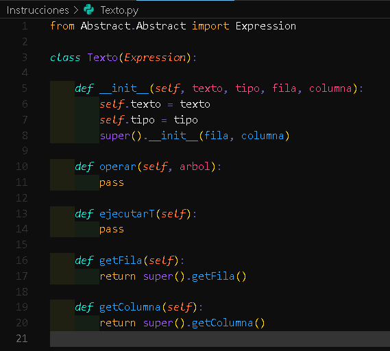

##### DeclaracionClaves. py

Se crea el constructor con los atributos, nombre, elementos, fila y columna, para las cuales usaremos en la declaracion de Declaracion de Claves.

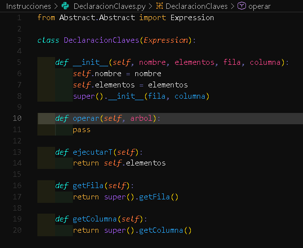

##### Registros. py

Se crea el constructor con los atributos, nombre, numero, fila y columna, los cuales utilizaremos en el Registro de los productos.

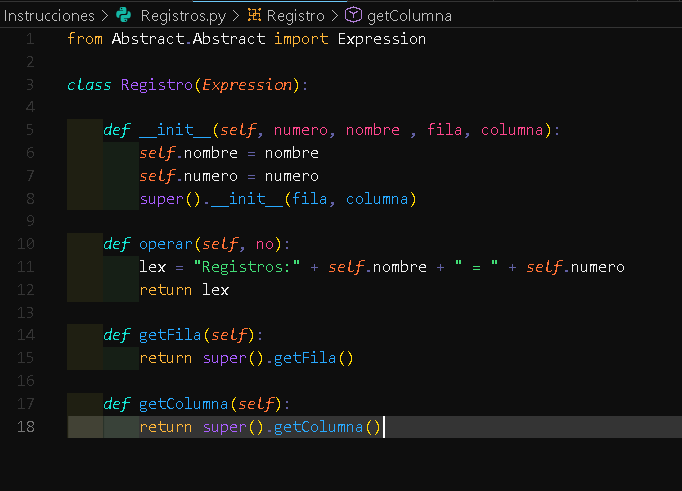

##### Imprimir. py

Se crea el constructor con los atributos, texto, fila y columna.
Retornamos el texto, esto para crear la funcionalidad "imprimir" nos retorne el texto en consola.

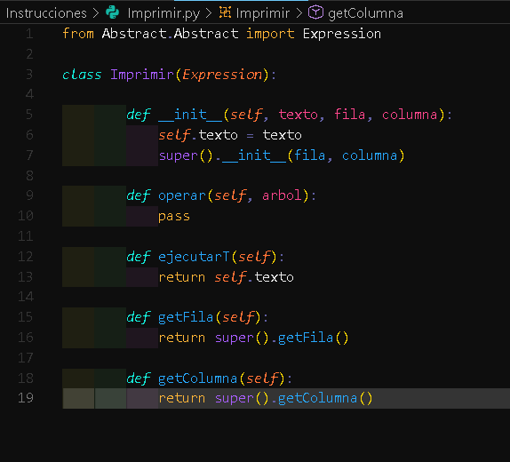

##### Imprimirln. py

Se crea el constructor con los atributos, texto, fila y columna.
Retornamos el texto con un salto de linea, esto para crear la funcionalidad "imprimirln" nos retorne el texto en consola.

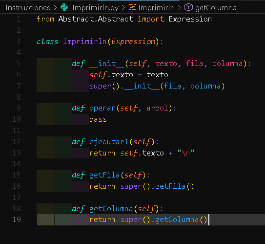

##### Datos. py

Se crea el constructor con los atributos, elementos, fila y columna. Retornamos el elemento de registros, para asi mostrar en consola el contenido de los registros.

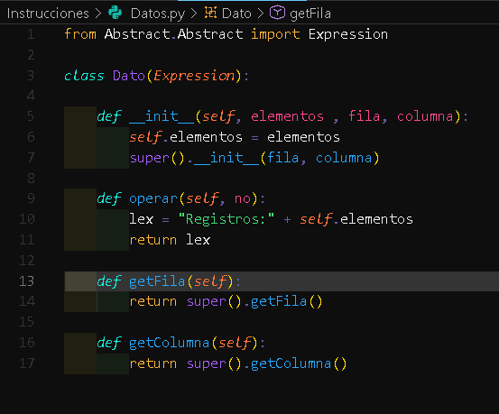

#### Anexos

##### AFD

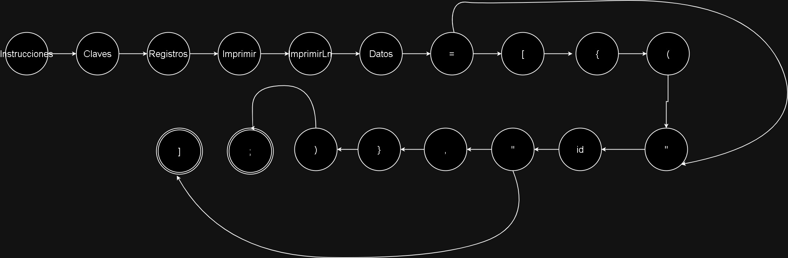