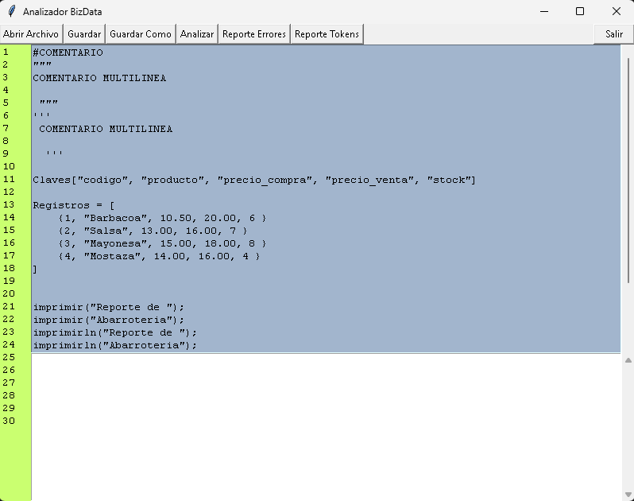
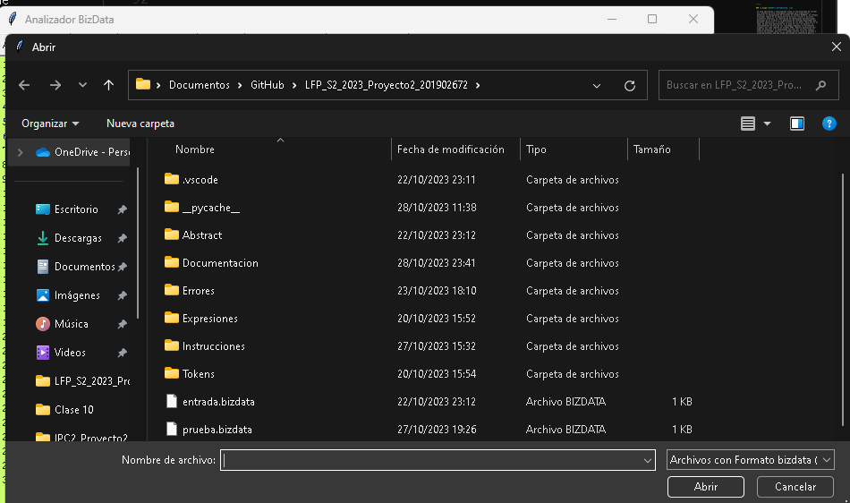
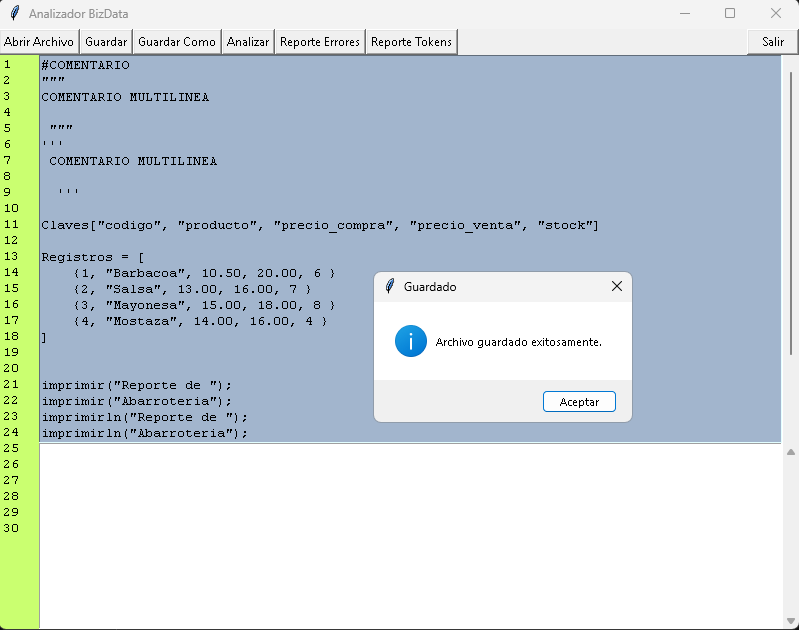
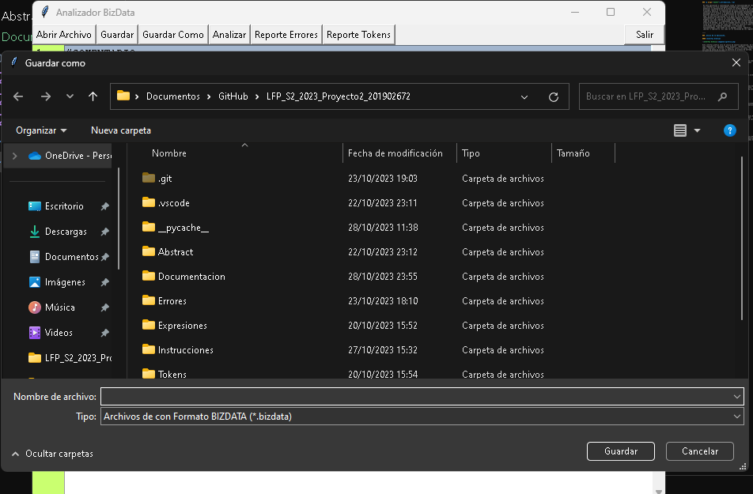
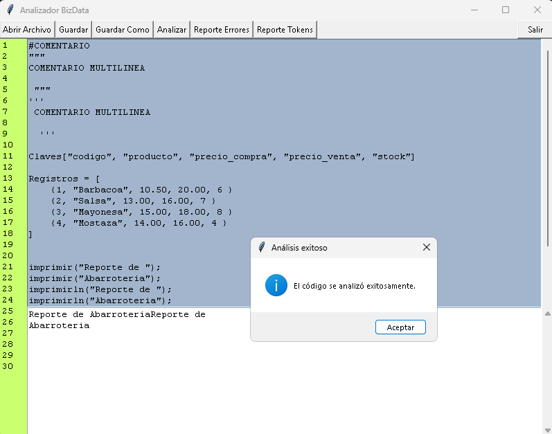
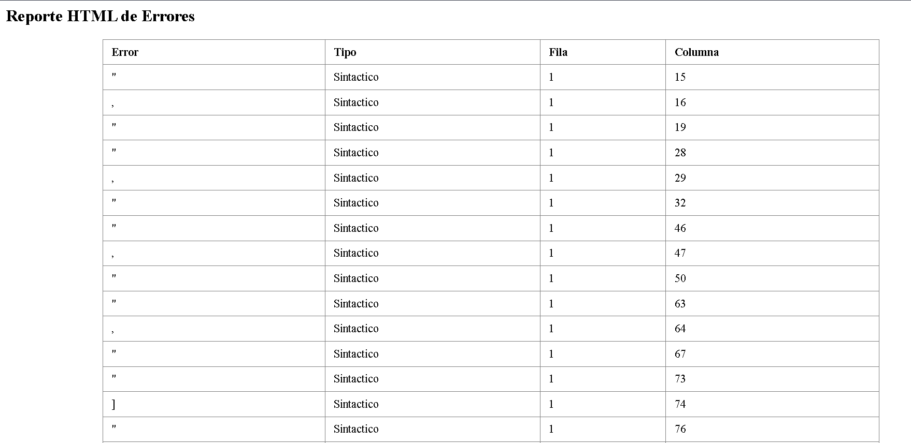
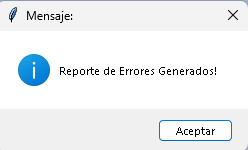

#### UNIVERSIDAD DE SAN CARLOS DE GUATEMALA
#### FACULTAD DE INGENIERÍA
#### ESCUELA DE CIENCIAS Y SISTEMAS
#### LENGUAJES FORMALES Y DE PROGRAMACION B+
#### ING. DAVID MORALES
#### AUX. FRANCISCO MAGDIEL ASICONA MATEO
#
#
#

### 
Proyecto No. 2 : Manual de Usuario
 

#
#
#
#### 
JAIRO ADELSO GOMEZ HERNANDEZ
 
#### 
CARNE : 201902672
 
#### 
2993206770101
 
#### 
SECCION B+
 
#### 
29 DE OCTUBRE DE 2023
 

-----

### 
_Introduccion_ 

 En esta aplicación a continuación tiene la funcionalidad de recrear una interfaz gráfica inteligente diseñada para simplificar y potenciar la manipulación de archivos en formato BIZDATA. Su enfoque principal radica en la ejecución de análisis léxicos y análisis sintactico precisos, la realización de operaciones personalizadas definidas en el archivo y la generación de informes detallados que permiten identificar y corregir errores en los datos. Pero eso no es todo, ya que esta aplicación va un paso más allá al permitir la representación gráfica de los resultados mediante la herramienta Graphviz asi como reporte en formato HTML. Nuestra aplicación será capaz de analizar e ir almacenando carácter por carácter nuestro archivo de entrada, para así ir armando nuestra lista de lexemas y lista de errores, una vez llena las listas se recorrerán para ir verificando las palabras reservadas e ir haciendo sus funcionalidades, como puede ser el agregar claves, registros, imprimir e imprimirln, asi como ver el contenido de los registros.

____

### _Inicio de la Aplicación_

#### *Interfaz Grafica*

Esta interfaz grafica sera el inicio de nuestra aplicacion, en la cual tendremos las opciones "Abrir Archivo", "Guardar", "Guardar Como", "Analizar", "Errores" y "Reporte" junto a un boton "Salir" y una area de texto en la cual se mostrara el archivo de entrada, y se le podra hacer modificaciones.

#### *Abrir*

Al presionar el boton abrir, se nos abrira una ventana en la cual deberemos seleccionar el archivo con formato json que deseamos analizar y que se pueda visualizar en el area de texto.

#### *Guardar*

Al presionar el boton guardar, guardara los cambios hechos previamente en el area de texto, y se guardaran en el mismo archivo. Mostrando un mensaje de que se ha guardado con exito.

#### *Guardar Como*

Al presionar el boton guardar como, se nos abrira una ventana en la cual podemos guardar los cambios en un archivo nuevo o en otro previamente creado. Mostrando un mensaje de que se ha creado con exito.

#### *Analizar*

Al presionar el boton Analizar, se analizara lexicamente y sintacticamente el archivo de entrada, y realizando las funciones que esten en el archivo de entrada y mostrando un mensaje de analisis correcto.

#### *Reporte Errores*

Al presionar el boton "Reporte Errores" se generara un archivo HTML con el nombre "Reporte_Errores_201902672.HTML" en el cual nos mostrara en una tabla, el error, el tipo de error, la fila y columna en la cual se encontro el error.

##### *Confirmacion del Reporte de Errores Creado!*

#### *Reporte Tokens*

Al presionar el boton "Reporte Tokens" se generara un archivo HTML con el nombre Reporte_Tokens_201902672.HTML en el cual se mostrara una tabla, donde nos mostra el lexema, el tipo, fila y columna de donde se analizo el achivo. 

----